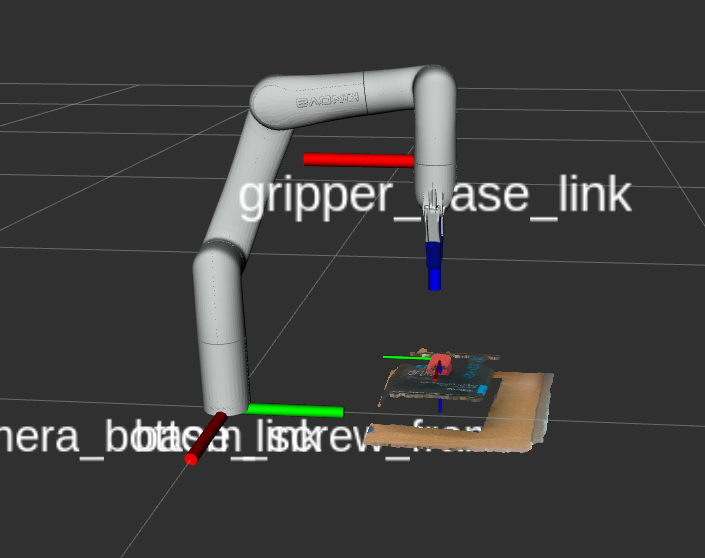
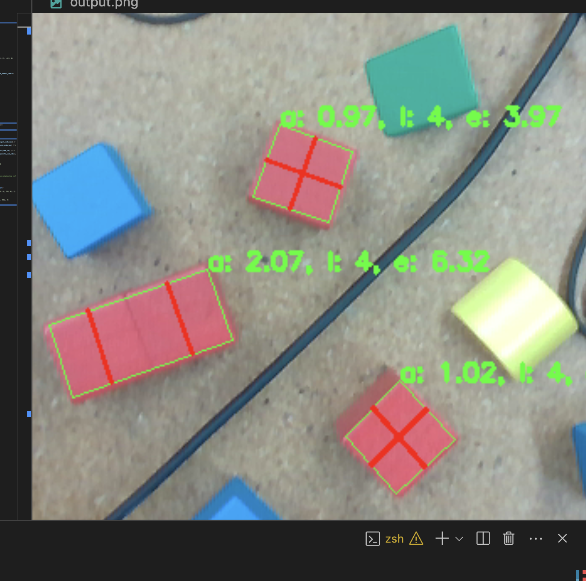

# Introducing Vision to a Robotic Grasping System


Intel RealSense D435i [wrist-mounted](https://archive.org/details/arm-camera-mount) on a Kinova Gen3 Lite.

## Motivation

Traditionally, robotic grasping enables automating simple, repetitive tasks. However, introducing vision can expand the versatility of a grasping system. The goal of this project is to demonstrate the capabilities of such a system interactively through a series of demonstrations.

## Supported Systems

AMD64 systems running Ubuntu. Supported NVIDIA GPU, at least 16gb memory and 256gb disk recommended.

## Installation Instructions

Install Ubuntu

1. Download an Ubuntu ISO from the [official website](https://releases.ubuntu.com/) and flash the image to a USB drive. I'm using 24.04 LTS as my host.
2. Boot from the USB drive and follow the onscreen instructions.
   - **Be careful not to overwrite anyone else's partitions if installing on a lab computer.**
   - Select "Install third-party software for graphics and Wi-fi hardware and additional media formats" when installing.

Make sure all packages are up to date

```bash
sudo apt update
sudo apt upgrade -y
```

Launch Software Updater and allow it to restart your system.

Install Docker ([instructions](https://docs.docker.com/engine/install/ubuntu/)) ([archive.org](https://web.archive.org/web/20240721033617/https://docs.docker.com/engine/install/ubuntu/))

Continue to [Linux Postinstall](https://docs.docker.com/engine/install/linux-postinstall/) and add yourself to the Docker group.

Install [NVIDIA Container Toolkit](https://docs.nvidia.com/datacenter/cloud-native/container-toolkit/latest/install-guide.html#setting-up-nvidia-container-toolkit) for CUDA support inside containers.

Restart Docker to enable Container Toolkit

```bash
systemctl restart docker
```

Download [Visual Studio Code](https://code.visualstudio.com/download) and the [Dev Containers Extension](https://marketplace.visualstudio.com/items?itemName=ms-vscode-remote.remote-containers).

Install Git and clone this repository.

```bash
sudo apt-get install git git-lfs -y
git clone http://github.com/blechdavier/merits-arm-control --recurse-submodules
```

Open the project.

```bash
code merits-arm-control
```

Reopen the project in a Dev Container.

1. Ctrl + Shift + P in VSCode to open the Command Palette
2. Choose "Dev Containers: Reopen in Container".

Wait for the container to start. The first launch could take around 10 minutes depending on your internet connection.

```bash
# install Python deps
pip install pipenv --user
pipenv install
# build ROS project
catkin build
source devel/setup.bash
```

### Developing outside of a container

If you don't want to use Docker, install Ubuntu 20.04 and follow the Dockerfile by hand on your system to set up all the necessary packages and dependencies.

## Demonstrations

### 3DOF grasping with point clustering

This approach is the simplest by far. I take a point cloud from the RealSense camera and filter the points by color. Then, I generate clusters of points and find the center: the mean position of the points in each cluster. This position is where the arm will then execute a grasp.



```bash
roslaunch gen3_lite_controller point_clustering.launch
```

### 6DOF Grasping with VGN

[Volumetric Grasping Network: Real-time 6 DOF Grasp Detection in Clutter](https://arxiv.org/abs/2101.01132) uses a 3D CNN to predict grasps given a TSDF (truncated signed distance function).

Drawbacks: Although the model performs well in simulations, it's imperfect in real-world experiments. It often attempts off-center grasps.

#### Clutter removal using VGN

The arm repetitively attempts grasps from its right side and brings the items to its left.

```bash
roslaunch gen3_lite_controller vgn.launch
```

#### Object sorting using VGN and YOLOv8

Deposit positions for each item classification are defined in `gen3_lite.yaml`. Similar to the clutter removal demo but it uses YOLO to associate grasps with item classes.

```bash
roslaunch gen3_lite_controller yolo_vgn.launch
```

### 4DOF grasping with polygon fitting

The motivation behind this approach was to maximize grasp success rate by simplifying the problem. I chose to limit the problem to top-down grasps of [red cubes](https://www.melissaanddoug.com/products/100-piece-wood-blocks-set).



A top-down image is taken and then masked by hue. Then, a value threshold is applied to isolate the top (brightest) face of the cubes.

This approach could maybe be improved by using a semantic segmentation model to generate contours instead of the color-based approach. It could also be improved by taking the depth map into account to better isolate the top faces of blocks from the sides.

### Tic-tac-toe demo using polygon fitting approach

[Demo Video Draft](https://drive.google.com/file/d/1xeYzbqpz7j0L1z18cl9wnztVsnIXWY93/view?usp=sharing)

```bash
roslaunch gen3_lite_controller tictactoe.launch
```

## Contributing

Feel free to email me at <xaviergbradford@gmail.com> and I can add you as a contributor. Alternatively, fork the repo.

## Known Issues

- The gripper sometimes fails to plan, complaining about the goal position being out of bounds. This is misleading; the real issue is that the starting position is slightly out of bounds. This can be fixed by going into the [Kinova Web App](192.168.1.10) and manually dragging the gripper position towards 50%.
- The Docker container isn't able to launch GUI apps. I tried setting up [X11](https://en.wikipedia.org/wiki/X_Window_System) in the container but was unable to get it working.
- Info level logs from the demo nodes don't show up in the terminal. I'm sure this is just a single setting or argument, but I wasn't able to find it. Instead, I incorrectly use warns and errors for logging.
